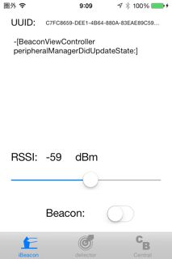
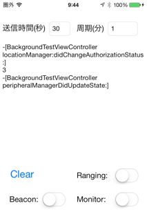

wafuBeacon
==========
iBeaconの実験やサンプルコードおよびユーティリティ・アプリケーションです。

simpleBeacon
----
simpleBeaconは、いつどんなデリゲートのメソッドが呼び出されるかを目で見るためのアプリケーションです。画面には呼び出されたデリゲートとその引数が表示されます。このアプリケーションは、Documentフォルダのファイル名 log.txt にログを残します。このファイルはiTunesのアプリケーションのファイル共有から取得できます。

アプリが使うUUIDは、baseViewController.h にハードコードでkBeaconUUID と定義しています。UUIDをビーコンにあわせたいならば、この定義を変更します。
周囲にEstimoteなどのビーコンがあっても反応しないように、このアプリケーションにはランダムに生成したUUIDを設定しています。

アプリには3つのタブがあります。

- iBeaconタブ
- detectorタブ
- Centralタブ

iBeaconタブはビーコンの電波送信をします。RSSIはパケットに設定する1m離れた地点でのRSSI値を指定します。下のBeaconスイッチは、ビーコンの電波送信のOn/Offです。ビーコンの電波を出している間でも、スライドバーでRSSI値を変更すれば、ビーコンの送信電波にそれが反映されます。

detectorタブは領域監視とレンジングの振る舞いを表示します。上のテキスト・ビューはデリゲートの呼び出しログを表示します。真ん中のInRegion:は領域内にいる/いないをBooleanで示します。右のClearボタンはログ画面のクリアです。このボタンはテキストビューをクリアするだけで、ログファイル log.txt はクリアされません。

真ん中の灰色の領域は検出したビーコンの識別子情報を表示します。

一番下にあるRegion MonitoringおよびRangingスイッチは、領域監視およびレンジングの開始/停止スイッチです。

最後のCentralタブは、CoreBluetoothで検出したアドバタイジング・パケットを表示します。iBeaconのビーコンのアドバタイジング・パケットを検出しても、ビーコンの識別子情報は取れない(スニッフィングはできない)ことを確認するために作りました。

backgroundMonitoring
----
バックグランドで領域監視をしているときの、ビーコンの検出時間と電池残量をロギングするためのテストアプリです。

上部のテキストアリアに指定した、周期(分)ごとに、送信時間(秒)だけビーコンを発信します。
デリゲートの呼び出しとその引数は中央のテキストビューに表示されます。ログ情報はDocument/log.txtに保存されます。このファイルはiTunesのアプリ共有から取り出せます。

下部のClearボタンはテキストビューのクリアです。このボタンを押してもログファイルlog.txtの内容はそのままで、クリアされません。

BeaconスイッチはビーコンのOn/Offです。ビーコンの送信は、アプリケーションがアクティブでなければなりません。ビーコンにするiOSデバイスは、設定でアプリのロックをしないに設定します。

RangingおよびMonitoringはレンジングと領域監視のOn/Offです。

iBeaconMonitor
----
周囲にあるビーコンの一覧および特定のビーコンのレンジングをするアプリケーションです。

検出対象のUUIDは、BeaconManager.h に kDefaultUUIDString で定義してハードコードしています。デフォルトでEstimoteのビーコンのUUIDを指定しています。UUIDを変更したいときは、ここを置き換えてください。

アプリケーションは3階層あります。最初の階層の、ビーコン選択は、それまでに検出したすべてのビーコンを一覧表示します。このなかからレンジングで監視し続けたいビーコンを選択して、右上のリストボタンを押します。

ビーコンリスト画面は、選択したビーコンのレンジング結果を表示し続けます。右の詳細ボタンを押すと、ビーコン詳細に表示遷移します。

ビーコン詳細は、1つのビーコンの詳細情報と、バックグランド通知の設定をします。バックグランドの通知結果は、ローカルノーティフィケーションします。

memoryeater
----
ひたすらメモリを確保しつづけるだけのアプリケーションです。画面右上のStartボタンを押すとメモリを確保し続けます。
メモリ不足を起こして他のバックグランド・アプリをterminated状態にするために使います。iOS自体が落ちてしまうことがあります。

